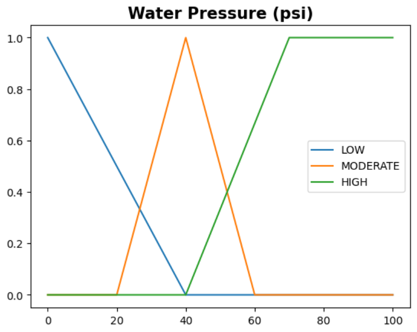
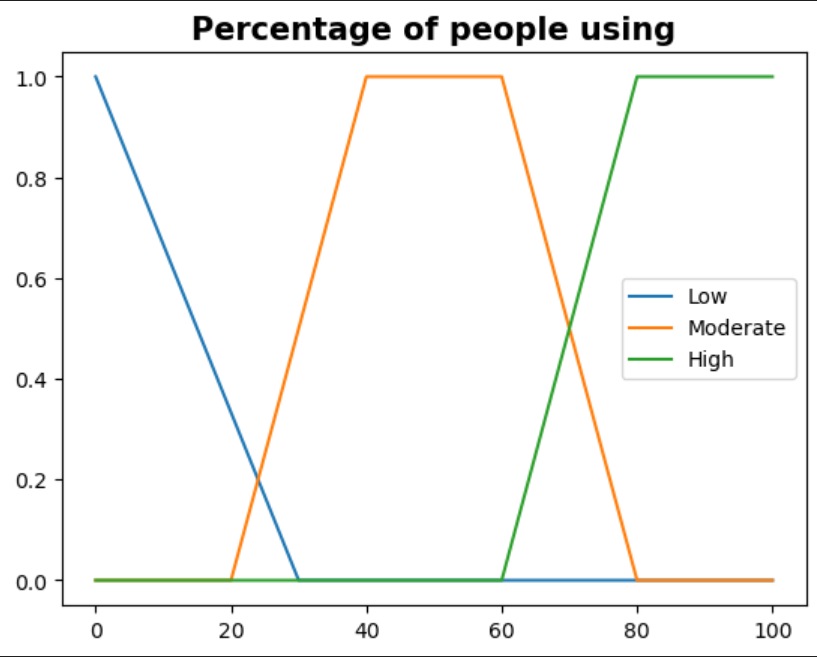
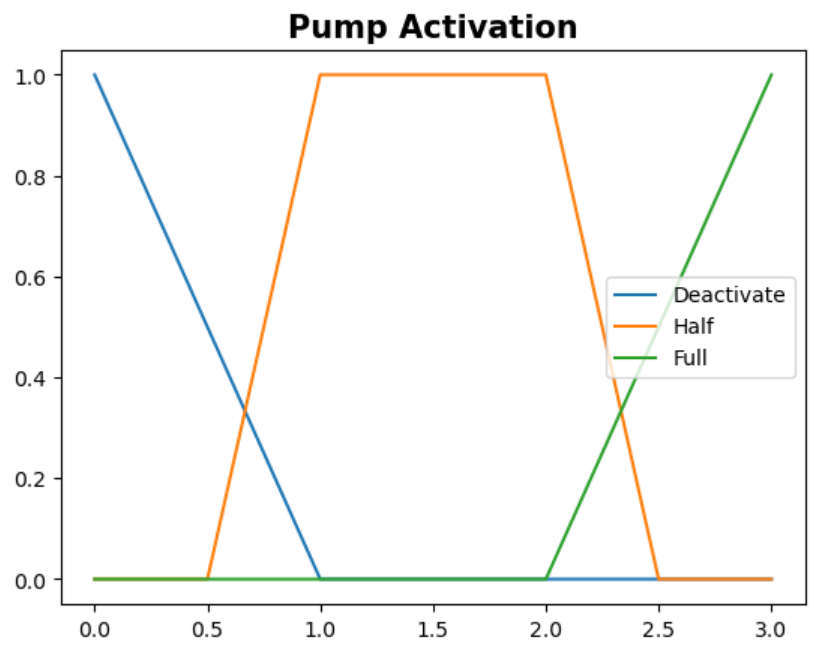

# Fuzzy Logic Controller for Water Pump System

## Description
This project implements a Fuzzy Logic Controller for a water pump system. The controller takes water pressure and water demand as inputs and outputs pump activation using fuzzy logic.

## Fuzzy Logic Variables

### Inputs
1. **Water Pressure**
   - Linguistic Variable: Low, Moderate, High
   - Universe of Discourse: 0-100
   - Membership Functions:
     
     - Low Pressure:
       ```python
       def low_pressure(u: float) -> float:
           if u >= 40:
               return 0
           return (40 - u) / 40
       ```
     - Moderate Pressure:
       ```python
       def moderate_pressure(u: float) -> float:
           res = 0
           if u <= 20 or u >= 60:
               return 0
           if u >= 20 and u <= 40:
               res = (u - 20) / (40 - 20)
           elif u >= 40 and u <= 60:
               res = (60 - u) / (60 - 40)
           return res
       ```
     - High Pressure:
       ```python
       def high_pressure(u: float) -> float:
           if u <= 40:
               return 0
           if u >= 40 and u <= 70:
               return (u - 40) / (70 - 40)
           return 1.0
       ```

2. **Water Demand**
   - Linguistic Variable: Low, Moderate, High
   - Universe of Discourse: 0-100
   - Membership Functions:
     
     - Low Demand:
       ```python
       def low_demand(u: float) -> float:
           if u >= 30:
               return 0
           return (30 - u) / 30
       ```
     - Moderate Demand:
       ```python
       def moderate_demand(u: float) -> float:
           res = 0
           if u <= 20 or u >= 80:
               return 0
           if u >= 20 and u <= 40:
               return (u - 20) / (40 - 20)
           if u >= 40 and u <= 60:
               return 1.0
           if u >= 60 and u <= 80:
               return (80 - u) / (80 - 60)
       ```
     - High Demand:
       ```python
       def high_demand(u: float) -> float:
           if u <= 60:
               return 0
           if u >= 60 and u <= 80:
               return (u - 60) / (80 - 60)
           return 1.0
       ```

### Output
1. **Pump Activation**
   - Linguistic Variable: Deactivate, Half, Full
     

## Rules

|         | LOW        | MODERATE   | HIGH       |
| ------- | ---------- | ---------- | ---------- |
| **LOW** | DEACTIVATE | HALF       | FULL       |
| **MODERATE** | DEACTIVATE | DEACTIVATE | FULL   |
| **HIGH** | DEACTIVATE | DEACTIVATE | HALF      |

## Output

`1.` Fuzzified input variables capture nuances like Low, Moderate, and High.

`2.` Applied rules define system responses for different input conditions.

`3.` Aggregated fuzzy outputs capture the overall decision-making process.

`4.` Center of gravity calculation converts aggregated fuzzy output to a crisp value.
